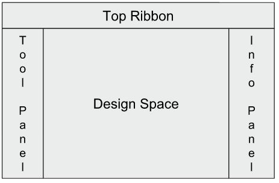
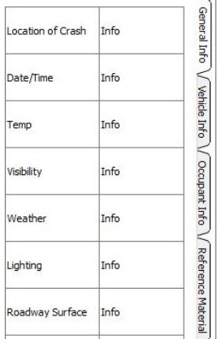
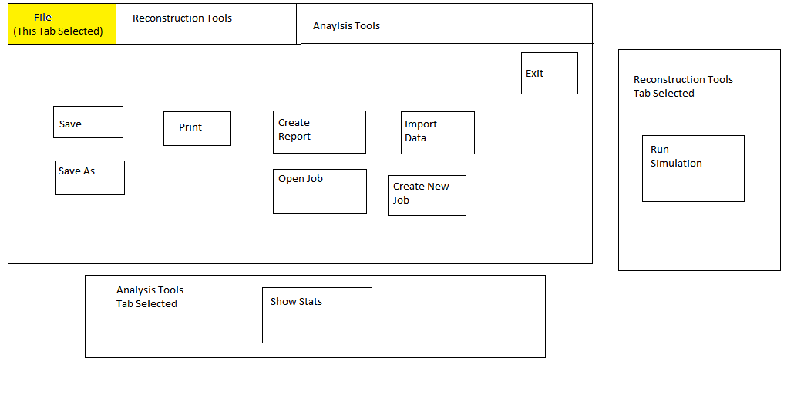

# Design

## Overview
This project aims to provide an end-to-end solution for crash and crime scene analysis. With 
law-enforcement in mind, we're working with Delta V Innovations to provide scene recreation, storage of 
captured data, and information sharing amongst users. Ultimately, the project should allow customers to 
collect field data from crash/crime scenes, such as images, weather data, location data (from Google 
Earth), etc. via a mobile application. This data will be uploaded to a database, one that also contains a 
wealth of reference materials, which can be accessed by other mobile app users or from the desktop 
application. Within the desktop application, the data can be used to reconstruct the scene with the data 
from the database using Computer-Aided Design (CAD) tools, and finally everything is bundled into a report 
on the incident. Extended functionality such as meta-analysis of incidents (i.e. "A disproportionate 
number of accidents occur at this intersection in the rain at night") and scene recreation viewable in 
Augmented Reality (AR) is planned for the future.

 

Our team (1 of 3) is specifically working on the desktop application. Our main tasks are creating a 
user-friendly, intuitive Graphical User Interface (GUI), connecting to the database to begin sending and 
retrieving data, and beginning to implement the scene recreation tools.

## Environment
The desktop application must run on Windows and MacOS. To handle this, we have decided to use 
[QT](https://www.qt.io "QT site homepage"), which is (among other things) a cross-platform GUI framework. 
The customer will continue with QT for free under an LGPL license, which imposes only trivial 
restrictions.

Our application must interact with the database team's database, which they are hosting via [Amazon Web Services (AWS)](https://aws.amazon.com "AWS site homepage") in [MySQL](https://www.mysql.com "MySQL site homepage").

## Module Description and Flow
Each tab will have its own class. Each button will have a method associated with it. 

The GUI is separated into four parts. The top ribbon has normal functions (file, save, open) and other basic functions for modeling. There are three tabs. This is the basic layout.

 

The right portion displays the information retrieved from the database. It has three tabs. These tabs are General Info, Vehicle Info, and Occupant Info. Each Tab will fill up the screen with info when they are clicked. The labels will be to the left and the info to the right.
This has changed from the original design of using tabs.

This is the original design implemented.

 

This is the new design that we will implement soon.

 
This is the basic original layout of the top ribbon.

The customer has specified that he wants the top ribbon tabs to be File, Edit, and Draw. On the Edit tab there will be:
  - Undo
  - Redo
  - Cut
  - Copy
  - Paste
  - Select
This tab will have no left side panel.
 On the Draw tab there will be the following buttons:
  - Point
  - Line
  - Polyline
  - Curve
  - Arc
  - Circle
  - Rectangle
  - Photo
  - Fill

The left portion of the GUI has advanced tools and formulas. This will change based upon the tab chosen on the top ribbon.
Shelby is currently working on the design image of this part of the GUI because the customer just provided the specifics on what tools and buttons it should contain. The following is the basic layout and how it will correspond to the top ribbon.
  
File Tab
  - New
  - Open
  - Save As
  - Save
  - Print
  - Save to Cloud
  - Import
  - Export
  - Close
  
Draw Tab
  
When Point is selected
  - Feet/Metric toggle button
  - Layer
  - X-Coordinate
  - Y-Coordinate
  - Elevation
  - Point to Symbol(drop down arrow with symbols/models found within–symbols will not be populated this semester)
    
When Line is Selected
  - Feet/Metric toggle button
  - Layer
  - length
  - width
  - color
  - starting elevation
  - ending elevation
  - Roadway lines
  - symbols, and symbol spacing
    
When Polyline is Selected
  - Feet/Metric toggle button
  - (2) boxes for types of polylines –polyline and perpendicular polyline
  - layer
  - length
  - width
  - color
  - starting elevation
  - ending elevation
  - roadway lines
  - symbolsand symbol spacing.
    
When Curve is Selected
  - Feet/Metric toggle button
  - (2) boxes for types of curves–fittedand spline
  - layer
  - length
  - width
  - color
  - starting elevation
  - ending elevation
  - roadway lines
  - symbols
    
When Arc is Selected
  - Feet/Metric toggle button
  - (3) boxes for types of arcs–3-point arc
  - 2 points and center arc, and 2-points and angle arc (just below each option for arc–have a box that will display the drawn arc’s center pointx-coordinate& y-coordinate and arc radius)
  - layer
  - length
  - width
  - color
  - starting elevation
  - ending elevation
  - roadway lines
    
When Circle is Selected
  - Feet/Metric toggle button
  - (7) boxes for types of circles–center point and side
  - 2-sides
  - 3-point circle
  - center point and radius
  - 2-tangent line circle
  - ellipse rectangle
  - ellipse axis(just below each option for circles–have a box that will display the drawn circle’s centerpoint x-coordinate& y-coordinate and arc radius)
  - layer
  - length
  - width
  - color
   
When Rectangle is Selected
  - Feet/Metric toggle button
  - (3) boxes for types of rectangles–rectangle
  - irregular polygon
  - irregular cloud (just below each option for circles–have a box that will display the drawn rectangle’sperimeter lengthandarea)
  - layer
  - width of lines and color.
    
When Photo is Selected
  - Browsebutton which will open a file explorer style windowin the center of the screen
    
When Fill is selected
  - Place 2 boxes on the top of the left work panel –Color and Hatch
  - Color will open a full color palletthat a user can drag and drop color from the pallet into a closed box which will fill with this color
  - Hatch will do the same thing, but with textures not colors
  
The center of the application will be used to create the 3D model of the crash.
This portion will be implemented with the back-end and may not be fully functional by the end of the semester.

